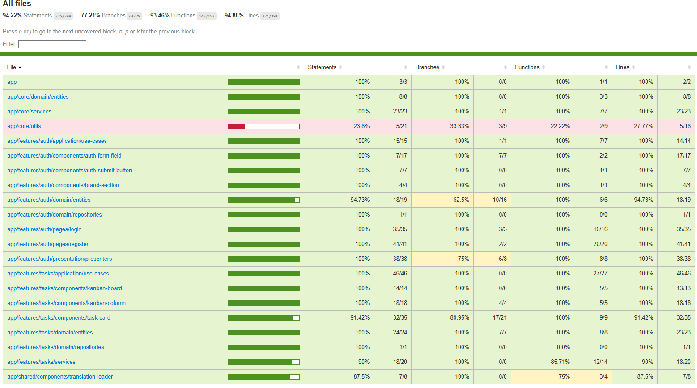

# ATOM FE CHALLENGE TEMPLATE - ANGULAR

Este proyecto es una plantilla con lo necesario para comenzar a desarrollar el front-end de la aplicación de la prueba técnica de Atom. Se base en Angular con la versión 17.3.6.

## Características

### Autenticación
- **Login/Registro**: Sistema completo de autenticación
- **Guards**: Protección de rutas con guards de autenticación
- **Interceptors**: Manejo automático de tokens JWT
- **Persistencia**: Almacenamiento local de sesión

### Gestión de Tareas
- **Tablero Kanban**: Vista de tareas organizadas por estado
- **Drag & Drop**: Arrastrar y soltar tareas entre columnas
- **CRUD Completo**: Crear, leer, actualizar y eliminar tareas
- **Prioridades**: Sistema de prioridades (Baja, Media, Alta, Urgente)
- **Fechas de vencimiento**: Gestión de fechas límite
- **Asignación**: Asignar tareas a usuarios

### Arquitectura
- **Arquitectura Hexagonal**: Separación clara de capas
- **Principios SOLID**: Código limpio y mantenible
- **Lazy Loading**: Carga diferida de módulos
- **Standalone Components**: Componentes independientes
- **Observables**: Manejo reactivo de datos

### Despliegue Automático
- **CI/CD con GitHub Actions**: Despliegue automático a Firebase Hosting
- **Workflow automatizado**: Deploy al hacer merge a master
- **Gestión de ramas**: Flujo de trabajo con develop y master

## Tecnologías

- **Angular 17**: Framework principal
- **Angular Material**: Componentes UI
- **Angular CDK**: Drag & Drop y utilidades
- **RxJS**: Programación reactiva
- **TypeScript**: Tipado estático
- **SCSS**: Estilos avanzados
- **Firebase Hosting**: Hosting de la aplicación
- **GitHub Actions**: CI/CD automatizado

## Despliegue Automático

Este proyecto cuenta con un sistema de despliegue completamente automatizado usando **GitHub Actions** y **Firebase Hosting**.

### Proceso de Despliegue

Para desplegar la aplicación, simplemente sigue estos pasos:

1. **Crear una rama de desarrollo**
   ```bash
   git checkout -b feature/nueva-funcionalidad
   ```

2. **Desarrollar y hacer commit de tus cambios**
   ```bash
   git add .
   git commit -m "feat: nueva funcionalidad"
   git push origin feature/nueva-funcionalidad
   ```

3. **Hacer merge a develop**
   - Crear un Pull Request hacia la rama `develop`
   - Revisar y aprobar los cambios
   - Hacer merge del PR

4. **Hacer merge a master para desplegar**
   - Crear un Pull Request desde `develop` hacia `master`
   - Al hacer merge a `master`, se **activa automáticamente** el despliegue

### Flujo de Trabajo

```
feature/branch → develop → master → DEPLOY AUTOMÁTICO
```

### Configuración del CI/CD

El workflow de GitHub Actions (`.github/workflows/deploy.yml`) se ejecuta automáticamente cuando:
- Se hace **push** o **merge** a la rama `master`
- Se crea un **Pull Request** hacia `master`

### Proceso Automático

Cuando se hace merge a `master`, el sistema automáticamente:

1. **Instala dependencias**: `npm install --legacy-peer-deps`
2. **Construye la aplicación**: `npm run build:prod`
3. **Ejecuta tests**: `npm test`
4. **Verifica la build**: Confirma que los archivos estén generados
5. **Despliega a Firebase**: Deploy automático a Firebase Hosting
6. **Notifica el resultado**: Success o error del despliegue

### URL de Producción

Una vez desplegado, la aplicación estará disponible en:
- **Firebase Hosting URL**: Se muestra en los logs del workflow

### Configuración de Secretos

El proyecto ya está configurado con los secretos necesarios en GitHub:
- `FIREBASE_SERVICE_ACCOUNT`: Credenciales de Firebase
- `FIREBASE_PROJECT_ID`: ID del proyecto Firebase

### Ventajas del Despliegue Automático

- **Sin intervención manual**: Todo es automático
- **Despliegue rápido**: En minutos desde el merge
- **Verificación automática**: Tests y build antes del deploy
- **Feedback inmediato**: Notificaciones del estado del despliegue
- **Rollback fácil**: Si hay problemas, hacer revert del merge
- **Disponibilidad global**: Firebase CDN mundial

### Importante

- **Solo los merges a `master` despliegan**: Los cambios en otras ramas no se despliegan
- **Tests obligatorios**: Si los tests fallan, no se despliega
- **Build verificada**: Si la build falla, no se despliega
- **Ambiente de producción**: El despliegue va directo a producción

**No necesitas instalar nada localmente para desplegar**! Solo hacer merge a master y el sistema se encarga del resto.

## Buenas Prácticas

### **Arquitectura Hexagonal (Clean Architecture)**
- **Separación de capas**: Dominio, aplicación, infraestructura y presentación claramente separadas
- **Independencia de frameworks**: El dominio no depende de Angular ni de librerías externas
- **Inversión de dependencias**: Las dependencias apuntan hacia el dominio
- **Testabilidad**: Cada capa puede ser testeada de forma independiente

### **Principios SOLID**
- **S** - **Single Responsibility**: Cada clase tiene una única responsabilidad
- **O** - **Open/Closed**: Abierto para extensión, cerrado para modificación
- **L** - **Liskov Substitution**: Las implementaciones son intercambiables
- **I** - **Interface Segregation**: Interfaces específicas para cada necesidad
- **D** - **Dependency Inversion**: Dependemos de abstracciones, no de implementaciones

### **Patrones de Diseño Implementados**
- **Repository Pattern**: Abstracción del acceso a datos
- **Use Case Pattern**: Casos de uso bien definidos para cada operación
- **Presenter Pattern**: Separación de lógica de presentación
- **Factory Pattern**: Creación de entidades de dominio
- **Observer Pattern**: Reactividad con RxJS

### **Características Técnicas Avanzadas**
- **Standalone Components**: Componentes independientes sin módulos
- **Lazy Loading**: Carga diferida de features
- **Dependency Injection**: Inyección de dependencias bien configurada
- **Reactive Programming**: Uso extensivo de RxJS y Observables
- **Type Safety**: TypeScript con tipos estrictos
- **Internationalization**: Soporte multiidioma con ngx-translate

### **Escalabilidad y Mantenibilidad**
- **Feature-based Structure**: Organización por características de negocio
- **Clear Boundaries**: Límites claros entre features
- **Reusable Components**: Componentes compartidos bien diseñados
- **Consistent Naming**: Convenciones de nomenclatura consistentes
- **Error Handling**: Manejo robusto de errores en todas las capas

## Estructura del Proyecto

```
src/
├── app/
│   ├── core/                           # Capa de infraestructura compartida
│   │   ├── constants/                  # Constantes de la aplicación
│   │   ├── domain/                     # Entidades de dominio compartidas
│   │   │   └── entities/               # Entidades del dominio
│   │   ├── guards/                     # Guards de autenticación
│   │   ├── interceptors/               # Interceptores HTTP
│   │   ├── services/                   # Servicios de aplicación
│   │   └── utils/                      # Utilidades y helpers
│   ├── features/                       # Módulos de características (Arquitectura Hexagonal)
│   │   ├── auth/                       # Módulo de autenticación
│   │   │   ├── application/            # Capa de aplicación
│   │   │   │   └── use-cases/          # Casos de uso
│   │   │   ├── components/             # Componentes de presentación
│   │   │   ├── domain/                 # Capa de dominio
│   │   │   │   └── repositories/       # Interfaces de repositorios
│   │   │   ├── infrastructure/         # Capa de infraestructura
│   │   │   │   └── repositories/       # Implementaciones de repositorios
│   │   │   ├── pages/                  # Páginas de la aplicación
│   │   │   ├── presentation/           # Capa de presentación
│   │   │   │   ├── presenters/         # Presentadores
│   │   │   │   ├── view-models/        # Modelos de vista
│   │   │   │   └── views/              # Interfaces de vista
│   │   │   ├── auth.config.ts          # Configuración de providers
│   │   │   └── auth.routes.ts          # Rutas de autenticación
│   │   └── tasks/                      # Módulo de tareas
│   │       ├── application/            # Capa de aplicación
│   │       │   └── use-cases/          # Casos de uso de tareas
│   │       ├── components/             # Componentes de tareas
│   │       ├── domain/                 # Capa de dominio
│   │       │   ├── entities/           # Entidades de tareas
│   │       │   └── repositories/       # Interfaces de repositorios
│   │       ├── infrastructure/         # Capa de infraestructura
│   │       │   └── repositories/       # Implementaciones de repositorios
│   │       ├── pages/                  # Páginas de tareas
│   │       ├── services/               # Servicios de tareas
│   │       └── tasks.config.ts         # Configuración de providers
│   ├── shared/                         # Componentes y utilidades compartidas
│   │   ├── components/                 # Componentes reutilizables
│   │   ├── directives/                 # Directivas personalizadas
│   │   ├── interfaces/                 # Interfaces TypeScript
│   │   └── pipes/                      # Pipes personalizados
│   ├── app.component.ts                # Componente principal
│   ├── app.config.ts                   # Configuración de la aplicación
│   └── app.routes.ts                   # Rutas principales
├── assets/                             # Recursos estáticos
│   ├── i18n/                          # Archivos de internacionalización
│   ├── images/                         # Imágenes
│   └── styles/                         # Estilos globales y temas
├── environments/                       # Configuraciones de entorno
└── main.ts                            # Punto de entrada de la aplicación
```

## Instalación

2. **Instalar dependencias**
   ```bash
   npm install --legacy-peer-deps
   ```

3. **Configurar variables de entorno**
   - Editar `src/environments/environment.ts`
   - Configurar la URL de la API

4. **Ejecutar en desarrollo**
   ```bash
   npm start
   ```

5. **Construir para producción**
   ```bash
   npm run build
   ```

### Autenticación
1. Navegar a `/auth/login` o `/auth/register`
2. Completar el formulario correspondiente
3. Al autenticarse, serás redirigido al tablero Kanban

### Gestión de Tareas
1. **Crear tarea**: Hacer clic en "Nueva Tarea" en la barra superior
2. **Editar tarea**: Hacer clic en el menú de la tarjeta → "Editar"
3. **Eliminar tarea**: Hacer clic en el menú de la tarjeta → "Eliminar"
4. **Mover tarea**: Arrastrar y soltar entre columnas

### Estados de Tareas
- **Por Hacer**: Tareas pendientes
- **En Progreso**: Tareas en desarrollo
- **Completado**: Tareas finalizada

### Estilos

Los estilos están organizados en:
- `src/styles.scss`: Estilos globales
- `src/assets/styles/`: Estilos específicos por componente
- Componentes individuales: Estilos encapsulados

## Testing

El proyecto incluye un **conjunto completo de 332 pruebas unitarias** que cubren todos los aspectos críticos de la aplicación con una **excelente cobertura** del código.

### 📊 Cobertura Actual - ¡Excelente!
- **Statements**: **94.22%** (375/398)
- **Lines**: **94.88%** (371/391)
- **Functions**: **93.46%** (143/153)
- **Branches**: **77.21%** (61/79)


*Resultado de las 332 pruebas unitarias ejecutadas exitosamente con alta cobertura de código*

### 🚀 Comandos de Testing
```bash
# Ejecutar todas las pruebas (332 pruebas)
npm test

# Ejecutar pruebas en modo watch
npm run test:watch

# Ejecutar pruebas con reporte de cobertura detallado
npm run test:coverage

# Ejecutar pruebas para CI/CD
npm run test:ci
```

### 📋 Reporte Detallado de Cobertura
Después de ejecutar `npm run test:coverage`, puedes ver el reporte HTML detallado en:
```
coverage/atom-challenge-fe-template/index.html
```

Este reporte muestra:
- ✅ **Líneas cubiertas** (en verde)
- ❌ **Líneas no cubiertas** (en rojo)
- ⚠️ **Ramas condicionales parcialmente cubiertas** (en amarillo)
- 📊 **Estadísticas por archivo y carpeta**

### 🛠️ Tecnologías de Testing
- **Jasmine**: Framework de testing
- **Karma**: Test runner con Chrome Headless
- **Angular Testing Utilities**: TestBed, ComponentFixture, etc.
- **Coverage Istanbul**: Reportes de cobertura de código
- **RxJS Testing**: Testing de observables y streams

### ✨ Características de las Pruebas
- **Mocking completo**: Servicios, presenters, routers mockeados
- **Testing async**: Manejo correcto de promesas y observables
- **Edge cases**: Casos límite y manejo de errores
- **Accessibility**: Verificación de estructura semántica
- **Integration**: Testing de integración entre componentes
- **Form testing**: Validación exhaustiva de formularios reactivos
- **Translation**: Testing de pipes de traducción

## Build

```bash
# Build de desarrollo
npm run build

# Build de producción
npm run build --configuration production
```

## Despliegue

1. **Construir la aplicación**
   ```bash
   npm run build --configuration production
   ```

2. **Servir archivos estáticos**
   - Los archivos se generan en `dist/`
   - Servir con cualquier servidor web estático

## Seguridad

- **Autenticación JWT**: Tokens seguros
- **Guards de ruta**: Protección de páginas
- **Interceptores HTTP**: Manejo automático de tokens
- **Validación de formularios**: Validación del lado cliente

## Responsive Design

La aplicación es completamente responsive y funciona en:
- Desktop
- Tablet
- Mobile

## Temas

La aplicación usa Angular Material con el tema "indigo-pink" por defecto. Puedes personalizar los colores editando los archivos de estilos

## Licencia

Este proyecto está bajo la Licencia MIT. Ver el archivo `LICENSE` para más detalles


## Changelog

### v1.0.0
- ✅ Sistema de autenticación completo
- ✅ Tablero Kanban funcional
- ✅ Drag & Drop de tareas
- ✅ CRUD de tareas
- ✅ Arquitectura hexagonal
- ✅ Angular Material UI
- ✅ Responsive design
